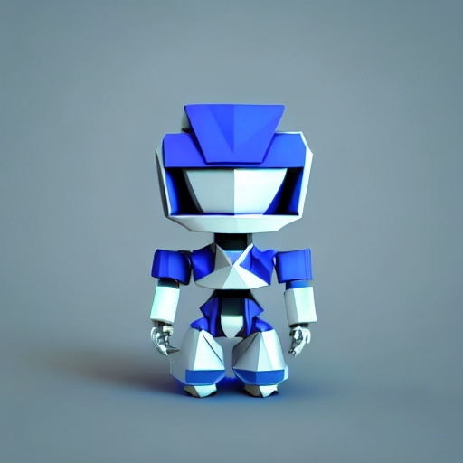
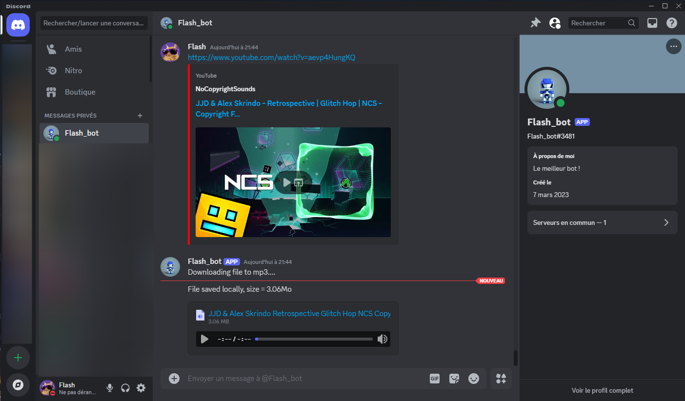

<br />
<div align="center">
  <h3 align="center">🎵 YouTube Music Discord Bot 🎵</h3>

   <a href="https://github.com/P-a0G/discord_bot">
    
  </a>

  <p align="center">
    Use a Discord bot to download YouTube music effortlessly
    <br />
    <a href="https://github.com/P-a0G/discord_bot/issues/new?labels=bug&template=bug-report---.md">Report Bug</a>
    ·
    <a href="https://github.com/P-a0G/discord_bot/issues/new?labels=enhancement&template=feature-request---.md">Request Feature</a>
  </p>
</div>

## Table of Contents

- [Description](#description)
- [Features](#features)
- [Installation](#installation)
- [Usage](#usage)
- [License](#license)
- [Contact Information](#contact-information)

## Description

This Discord bot allows you to download YouTube music, subscribe to your favorite artists for daily updates, and fetch
music from specified artists.

<a href="https://github.com/P-a0G/discord_bot">
    
  </a>

## Features

🎵 **YouTube to MP3 Conversion**  
Easily convert and download music from YouTube by sending a URL.

📅 **Daily Artist Updates**  
Subscribe to your favorite artists to get daily updates on their latest tracks.

🎶 **Top Tracks Fetching**  
Fetch and download the top N most viewed tracks of any artist.

🤖 **Interactive Commands**  
Use simple, intuitive commands to interact with the bot:

- `!sub artist_name` - Subscribe to daily updates.
- `!unsub artist_name` - Unsubscribe from updates.
- `!get artist_name N` - Get the top N tracks of an artist.

## Installation

1. **Get a Discord Token**
   - Visit the [Discord Developer Portal](https://discord.com/developers/applications).
   - Create a new application and navigate to the "Bot" section.
   - Click "Add Bot" and copy the token provided.

2. **Get a Google API Token**
   - Visit the [Google Cloud Console](https://console.cloud.google.com/).
   - Create a project and enable the "YouTube Data API v3".
   - Create credentials for an API key and note it down.

3. **Install Python and Dependencies**
   - Install [Python 3.10](https://www.python.org/downloads/).
   - Install the required dependencies:
     ```bash
     pip install -r requirements.txt
     ```

4. **Add Your Bot to Your Discord Server**
   - Go to the OAuth2 section in the Discord Developer Portal.
   - Select `bot` and necessary permissions.
   - Copy the generated URL and paste it into your browser.
   - Select your server and authorize the bot.

5. **Run the Initialization Script**
   ```bash
   python3 init_bot.py
    ```

6. **Start the Bot**
    ```bash
    python3 discord_bot.py
    ```

7. **Usage**
   - Use the `!help` command to get a list of available commands.
   - Send a `YouTube URL` in a Discord channel or via a private message, the bot will download the file and send it back
   - Use the `!sub artist_name` this adds the artist to your subscription list for daily updates.
   - Use the `!unsub artist_name` this removes the artist from your subscription list.
   - Use the `!get artist_name N` downloads the top N tracks of the artist (default: 10).

**Note:** `artist_name` can not contain spaces. Be careful with daily free quota limits of google api.

## License

This project is licensed under the MIT License - see the [LICENSE](LICENSE) file for details.

## Contact Information

For support or feature requests, please create an issue on the GitHub repository.
Let me know if you'd like any adjustments! Quick links at the top of the README.

